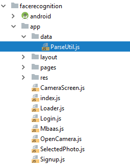

## Step 8:  Connect Mobile App to Huawei Mobile Backend

You have already download the Mobile Application as part of the example code.  Now it is time to connect it to Huawei Mobile Backend in Public Cloud.  

1.	Find out the Application URL of the Mobile Backend created in Step 1 from in Service Stage Console [https://console.huaweicloud.com/servicestage/?region=cn-north-1#/apps/list](https://console.huaweicloud.com/servicestage/?region=cn-north-1#/apps/list). **The url will contain the name you picked during provisioning**, for example, http://mydemoapp.cn-north-1.huaweicse.com.

2.	Open the file `<path to>/facerecodemo/app/data/PareUtil.js`, you can use the Android Studio for this (File > Open)
	
  

3.	Locate the `init()` method at the bottom of the file. 

4.	Replace myAppID with your Mobile Backend’s **appID** specified in Step 1.

  

5.	Locate the `hostIP,port` variables in the file.

  

6.	Replace the host deails of your Mobile Backend and Save the file.  

  
